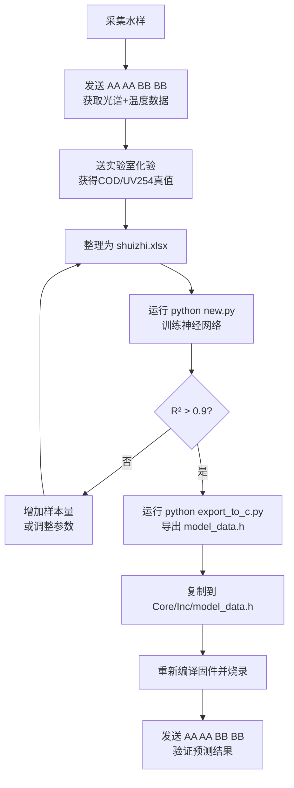

# Water_2 水质检测与 AI 预测嵌入式系统

## 技术参考手册

| 文档编号 | WHISKY-W2-TRM-001 |
|---------|-------------------|
| 版本 | 2.1 |
| 日期 | 2026-07-08 |
| 状态 | 正式发布 |
| 密级 | 内部 |

---

## 目录

1. [引言](#1-引言)
   - 1.1 [项目概述](#11-项目概述)
   - 1.2 [适用范围](#12-适用范围)
   - 1.3 [术语与缩略语](#13-术语与缩略语)
   - 1.4 [参考文档](#14-参考文档)
2. [系统架构设计](#2-系统架构设计)
   - 2.1 [系统总体架构](#21-系统总体架构)
   - 2.2 [硬件架构](#22-硬件架构)
   - 2.3 [软件架构](#23-软件架构)
3. [硬件设计](#3-硬件设计)
   - 3.1 [微控制器选型](#31-微控制器选型)
   - 3.2 [引脚分配表](#32-引脚分配表)
   - 3.3 [系统时钟树设计](#33-系统时钟树设计)
   - 3.4 [外设资源配置](#34-外设资源配置)
4. [STM32CubeMX 配置指南](#4-stm32cubemx-配置指南)
   - 4.1 [工程创建与 MCU 选择](#41-工程创建与-mcu-选择)
   - 4.2 [引脚配置](#42-引脚配置)
   - 4.3 [时钟配置](#43-时钟配置)
   - 4.4 [外设配置详情](#44-外设配置详情)
   - 4.5 [NVIC 中断配置](#45-nvic-中断配置)
   - 4.6 [工程管理设置](#46-工程管理设置)
5. [软件设计](#5-软件设计)
   - 5.1 [软件模块划分](#51-软件模块划分)
   - 5.2 [模块接口定义](#52-模块接口定义)
   - 5.3 [主程序流程](#53-主程序流程)
   - 5.4 [通信协议设计](#54-通信协议设计)
     - 5.4.5 [工作模式说明](#545-工作模式说明)
   - 5.5 [AI 推理引擎](#55-ai-推理引擎)
   - 5.6 [数据采集与模型训练](#56-数据采集与模型训练)
6. [构建与编译](#6-构建与编译)
   - 6.1 [开发环境要求](#61-开发环境要求)
   - 6.2 [Keil MDK 构建](#62-keil-mdk-构建)
   - 6.3 [VS Code + EIDE 构建](#63-vs-code--eide-构建)
   - 6.4 [编译选项详解](#64-编译选项详解)
7. [烧录与调试](#7-烧录与调试)
   - 7.1 [调试接口配置](#71-调试接口配置)
   - 7.2 [烧录方法](#72-烧录方法)
   - 7.3 [调试设置](#73-调试设置)
8. [使用指南](#8-使用指南)
   - 8.1 [首次上电流程](#81-首次上电流程)
   - 8.2 [数据通信](#82-数据通信)
   - 8.3 [模型更新流程](#83-模型更新流程)
9. [故障排除](#9-故障排除)
10. [附录](#10-附录)
    - 10.1 [项目文件结构](#101-项目文件结构)
    - 10.2 [版本历史](#102-版本历史)
11. [工程整理规范](#11-工程整理规范)
    - 11.1 [目录职责](#111-目录职责)
    - 11.2 [关键一致性规则](#112-关键一致性规则)
    - 11.3 [发布前最小检查清单](#113-发布前最小检查清单)
    - 11.4 [推荐版本标记方式](#114-推荐版本标记方式)

---

## 1. 引言

### 1.1 项目概述

Water_2 是基于意法半导体 **STM32G431RBT6** 微控制器的嵌入式水质检测系统固件工程。本系统集成双光路光谱采样（254nm / 550nm）、高精度温度采集（DS18B20）、24 位高精度 ADC 数据采集（ADS1220）、串口通信指令解析与 JSON 状态上报，以及端侧 BP 神经网络推理引擎，实现对水质化学需氧量（COD）与紫外吸光度（UV254）的实时预测。

**核心功能特性：**

- 双波长（254nm / 550nm）光信号采集与处理
- 24 位高精度 ADC 数据采集（ADS1220，SPI 接口）
- 数字温度传感器（DS18B20，OneWire 协议）环境温度监测
- 双串口通信：调试输出（USART1）与数据上报（USART3）
- 串口指令接收状态机（支持 AA AA BB BB、CC CC CC、DD DD DD、EE EE EE 多条指令序列）
- 端侧三层全连接神经网络推理（3→32→16→2，tansig 激活）
- 定时心跳 JSON 上报（1Hz）与测量结果 JSON 上报（0.1Hz）
- PWM 光源控制输出

### 1.2 适用范围

本文档适用于以下技术人员：

- 嵌入式固件开发工程师
- 硬件设计工程师
- 系统集成与测试工程师
- 算法工程师（需理解端侧推理流程进行模型更新）

### 1.3 术语与缩略语

| 术语/缩略语 | 全称 | 说明 |
|------------|------|------|
| STM32 | STMicroelectronics 32-bit MCU | 意法半导体 32 位微控制器 |
| STM32G431RBT6 | - | STM32G4 系列，Cortex-M4，128KB Flash，32KB SRAM，LQFP64 |
| HAL | Hardware Abstraction Layer | STM32 硬件抽象层 |
| CMSIS | Cortex Microcontroller Software Interface Standard | ARM Cortex 微控制器软件接口标准 |
| CubeMX | STM32CubeMX | STM32 图形化配置工具 |
| ADS1220 | - | TI 24 位 ΔΣ ADC |
| DS18B20 | - | Maxim 数字温度传感器 |
| COD | Chemical Oxygen Demand | 化学需氧量 |
| UV254 | UV Absorbance at 254nm | 254nm 紫外吸光度 |
| PWM | Pulse Width Modulation | 脉宽调制 |
| SPI | Serial Peripheral Interface | 串行外设接口 |
| UART/USART | Universal Synchronous/Asynchronous Receiver-Transmitter | 通用同步/异步收发器 |
| OneWire | - | 单总线通信协议 |
| BP | Back Propagation | 反向传播（神经网络） |
| tansig | Hyperbolic Tangent Sigmoid | 双曲正切 S 型激活函数 |
| JSON | JavaScript Object Notation | JavaScript 对象表示法 |
| IDE | Integrated Development Environment | 集成开发环境 |
| SWD | Serial Wire Debug | 串行线调试 |
| EIDE | Embedded IDE | VS Code 嵌入式开发插件 |

### 1.4 参考文档

| 编号 | 文档名称 | 版本 |
|------|---------|------|
| RM0440 | STM32G4 Series Reference Manual | Rev 8 |
| DS13135 | STM32G431x6/x8/xB Datasheet | Rev 5 |
| UM1718 | STM32CubeMX User Manual | - |
| ADS1220 | ADS1220 Datasheet (TI SBAS501C) | Rev C |
| DS18B20 | DS18B20 Datasheet (Maxim) | - |
| UM2609 | STM32CubeG4 Firmware Package | V1.6.1 |

---

## 2. 系统架构设计

### 2.1 系统总体架构

```
┌──────────────────────────────────────────────────────────────────┐
│                         Water_2 系统                              │
├──────────────────────────────────────────────────────────────────┤
│  ┌─────────────┐  ┌─────────────┐  ┌─────────────┐               │
│  │  254nm LED  │  │  550nm LED  │  │  DS18B20    │               │
│  │  (TIM1_CH3) │  │  (TIM1_CH2) │  │  (PA15)     │               │
│  └──────┬──────┘  └──────┬──────┘  └──────┬──────┘               │
│         │                │                │                       │
│  ┌──────▼────────────────▼────────────────▼──────┐               │
│  │            ADS1220 24-bit ADC                 │               │
│  │         SPI1 (PA5/PA6/PA7)                    │               │
│  │         CS: PA4   DRDY: PA3                   │               │
│  └──────────────────────┬────────────────────────┘               │
│                         │ SPI                                    │
│  ┌──────────────────────▼────────────────────────┐               │
│  │            STM32G431RBT6 (Cortex-M4)          │               │
│  │                                                │               │
│  │  ┌─────────┐  ┌──────────┐  ┌──────────────┐  │               │
│  │  │ 数据采集 │  │ AI 推理  │  │  通信管理    │  │               │
│  │  │ 模块    │  │ 引擎     │  │  模块        │  │               │
│  │  └────┬────┘  └────┬─────┘  └──────┬───────┘  │               │
│  │       │             │               │          │               │
│  └───────┼─────────────┼───────────────┼──────────┘               │
│          │             │               │                          │
│  ┌───────▼─────┐ ┌─────▼─────┐  ┌──────▼───────┐                 │
│  │  USART1     │ │  USART3   │  │  SWD Debug   │                 │
│  │  (PC4/PC5)  │ │(PB10/PB11)│  │  (PA13/PA14) │                 │
│  │  调试打印   │ │ 数据上报  │  │  调试接口    │                 │
│  └─────────────┘ └───────────┘  └──────────────┘                 │
└──────────────────────────────────────────────────────────────────┘
```

**架构说明：**

系统采用**集中式采集-处理-上报**架构。STM32G431RBT6 作为主控核心，通过 SPI 接口与 ADS1220 24 位高精度 ADC 通信，采集经光电转换后的双波长光谱信号；通过 GPIO 模拟 OneWire 协议读取 DS18B20 温度数据。TIM1 高级定时器提供两路 PWM 输出，分别驱动 254nm 和 550nm 光源 LED 的恒流控制。主控芯片内置端侧神经网络推理引擎，对采集数据进行实时处理并输出 COD/UV254 预测结果。USART3 负责与上位机通信，按照 Json 格式上报心跳状态与测量结果；USART1 用于调试信息输出。

### 2.2 硬件架构

```
                            ┌─────────────────────────┐
                  ┌─ HSI ──┤16MHz 内部高速振荡器       │
                  │         └───────────┬─────────────┘
                  │                     │ ×85 / /4 / /2
                  │              ┌──────▼──────┐
                  │              │    PLL      │
                  │              │ 170 MHz     │
                  │              └──────┬──────┘
                  │                     │
    ┌─────────────┼─────────────────────┼─────────────────────┐
    │             │     STM32G431RBT6   │                     │
    │             │                     │                     │
    │  ┌──────────▼──┐  ┌───────────┐  ├──────────┐          │
    │  │  SYSCLK     │  │  HCLK     │  │ APB1/2   │          │
    │  │  170 MHz    │  │  170 MHz  │  │ 170 MHz  │          │
    │  └─────────────┘  └───────────┘  └──────────┘          │
    │                                                         │
    │  ┌──────────────────────────────────────────────────┐   │
    │  │                   总线矩阵                         │   │
    │  └──┬────────┬────────┬────────┬────────┬────────┬──┘   │
    │     │        │        │        │        │        │      │
    │  ┌──▼──┐ ┌──▼──┐ ┌──▼──┐ ┌──▼──┐ ┌──▼──┐ ┌──▼──┐     │
    │  │SPI1 │ │ADC1 │ │ADC2 │ │TIM1 │ │USART│ │GPIO │     │
    │  │     │ │IN1  │ │IN2  │ │CH2,3│ │1,3  │ │     │     │
    │  └─────┘ └─────┘ └─────┘ └─────┘ └─────┘ └─────┘     │
    │                                                         │
    └─────────────────────────────────────────────────────────┘
```

**关键硬件参数：**

| 参数 | 值 | 说明 |
|------|-----|------|
| 主控芯片 | STM32G431RBT6 | Cortex-M4F, 170MHz |
| 封装 | LQFP64 | 64 引脚 |
| Flash | 128 KB | - |
| SRAM | 32 KB | - |
| 外部晶振 | (未使用) | 使用内部 HSI |
| 外部低速晶振 | 32.768 kHz | LSE，用于 RTC |
| 工作电压 | 3.3V | - |

### 2.3 软件架构

```
┌─────────────────────────────────────────────────────────┐
│                     应用层 (Application)                 │
│  ┌─────────┐  ┌─────────┐  ┌──────────┐  ┌───────────┐ │
│  │ main.c  │  │AllSet.c │  │Led.c     │  │water_     │ │
│  │ 主循环  │  │采样流程 │  │光控采样  │  │quality_ai │ │
│  │ 命令处理│  │JSON 上报│  │          │  │AI 推理    │ │
│  └────┬────┘  └────┬────┘  └────┬─────┘  └─────┬─────┘ │
├───────┼────────────┼────────────┼───────────────┼───────┤
│       │    驱动抽象层 (Driver Abstraction)       │       │
│  ┌────▼────────────▼────────────▼─────┐  ┌──────▼──────┐│
│  │         ADS1220.c/h               │  │  Ds18B20.c/h││
│  │    24位ADC SPI 驱动               │  │  OneWire    ││
│  └────────────────┬──────────────────┘  └─────────────┘│
├───────────────────┼─────────────────────────────────────┤
│          HAL 层 (STM32Cube HAL)                         │
│  ┌────┐ ┌────┐ ┌────┐ ┌────┐ ┌────┐ ┌────┐ ┌──────┐   │
│  │SPI │ │ADC │ │TIM │ │USART│ │GPIO│ │RCC │ │PWR   │   │
│  └────┘ └────┘ └────┘ └────┘ └────┘ └────┘ └──────┘   │
├─────────────────────────────────────────────────────────┤
│              CMSIS Core (Cortex-M4)                     │
└─────────────────────────────────────────────────────────┘
```

**软件层次说明：**

1. **CMSIS Core 层：** ARM Cortex-M4 内核访问接口，包括 NVIC、SysTick 等。
2. **HAL 层：** STM32CubeG4 HAL 驱动库，由 CubeMX 自动生成，提供标准化外设 API。
3. **驱动抽象层：** 针对特定外设芯片（ADS1220、DS18B20）的驱动封装，屏蔽底层 SPI/GPIO 操作细节。
4. **应用层：** 业务逻辑实现，包括主循环调度、采样流程控制、AI 推理调用、通信协议处理。

---

## 3. 硬件设计

### 3.1 微控制器选型

| 属性 | 说明 |
|------|------|
| 型号 | STM32G431RBT6 |
| 系列 | STM32G4（混合信号高性能系列） |
| 内核 | ARM Cortex-M4，带 FPU 与 DSP 指令集 |
| 最大主频 | 170 MHz |
| Flash | 128 KB |
| SRAM | 32 KB（含 10 KB CCM SRAM） |
| ADC | 2×12-bit 5 MSPS ADC（最多 23 通道） |
| 定时器 | 3×高级定时器，7×通用定时器，2×基本定时器 |
| 通信接口 | 3×SPI, 3×USART, 2×UART, 3×I2C, 1×FDCAN, 1×USB 2.0 FS |
| 封装 | LQFP64（64 引脚） |
| 工作温度 | -40°C ~ 85°C |
| 供电电压 | 1.71V ~ 3.6V |

**选型理由：**

STM32G431RBT6 属于 STM32G4 系列混合信号 MCU，内置高性能 12 位 ADC（最高 5 MSPS），并集成 Cortex-M4F 浮点运算单元（FPU）与 DSP 扩展指令，适合需要高精度模拟信号采集与实时数字信号处理的嵌入式应用。170 MHz 主频搭配 FPU 能够高效执行端侧神经网络推理计算，128 KB Flash 足以容纳固件代码与模型权重参数。

### 3.2 引脚分配表

#### 3.2.1 完整引脚分配

| 编号 | 引脚 | 功能标识 | 功能描述 | 模式 | 电气特性 | 备注 |
|------|------|---------|---------|------|---------|------|
| 1 | PC14 | OSC32_IN | 外部低速时钟输入 | 模拟 | 外接 32.768kHz 晶振 | LSE 时钟源 |
| 2 | PC15 | OSC32_OUT | 外部低速时钟输出 | 模拟 | 外接 32.768kHz 晶振 | LSE 时钟源 |
| 3 | PF0 | OSC_IN | 外部高速时钟输入 | 模拟 | 备用 | 未使用，保留 |
| 4 | PF1 | OSC_OUT | 外部高速时钟输出 | 模拟 | 备用 | 未使用，保留 |
| 5 | PA0 | ADC1_IN1 | ADC1 模拟输入通道 1 | 模拟 | 0~3.3V | 连接模拟传感器 |
| 6 | PA1 | ADC2_IN2 | ADC2 模拟输入通道 2 | 模拟 | 0~3.3V | 连接模拟传感器 |
| 7 | PA3 | AD_DRDY | ADS1220 数据就绪信号 | 数字输入 | 上拉，3.3V 逻辑 | ADS1220 DRDY 引脚，低电平有效 |
| 8 | PA4 | AD_CS | ADS1220 片选信号 | 推挽输出 | 下拉，高速，3.3V | 默认高电平（ADC 未选中） |
| 9 | PA5 | SPI1_SCK | SPI1 串行时钟 | 复用推挽 | AF5，无上下拉，低频 | 连接 ADS1220 SCLK |
| 10 | PA6 | SPI1_MISO | SPI1 主机输入/从机输出 | 复用推挽 | AF5，无上下拉，低频 | 连接 ADS1220 DOUT/DRDY |
| 11 | PA7 | SPI1_MOSI | SPI1 主机输出/从机输入 | 复用推挽 | AF5，无上下拉，低频 | 连接 ADS1220 DIN |
| 12 | PA12 | LED | 板载 LED 指示灯 | 推挽输出 | 下拉，超高速，3.3V | 高电平点亮 |
| 13 | PA13 | SWDIO | 串行线调试数据 | 复用 | - | SWD 调试接口数据线 |
| 14 | PA14 | SWCLK | 串行线调试时钟 | 复用 | - | SWD 调试接口时钟线 |
| 15 | PA15 | DS18B20_DQ | DS18B20 数据总线 | 开漏输出/输入 | 上拉，高速 | OneWire 单总线协议 |
| 16 | PC1 | OC7140_1 / TIM1_CH2 | 550nm 光源 PWM 控制 | 复用推挽 | 下拉，超高速 | TIM1 通道 2 PWM 输出 |
| 17 | PC2 | OC7140_2 / TIM1_CH3 | 254nm 光源 PWM 控制 | 复用推挽 | 下拉，超高速 | TIM1 通道 3 PWM 输出 |
| 18 | PC4 | USART1_TX | USART1 发送 | 复用推挽 | AF7，超高速 | 调试串口 TX |
| 19 | PC5 | USART1_RX | USART1 接收 | 复用推挽 | AF7，超高速 | 调试串口 RX |
| 20 | PC12 | Boom | 外设使能控制 | 推挽输出 | 上拉，超高速，3.3V | 高电平使能外设 |
| 21 | PB10 | USART3_TX | USART3 发送 | 复用推挽 | AF7，超高速 | 通信串口 TX |
| 22 | PB11 | USART3_RX | USART3 接收 | 复用推挽 | AF7，超高速 | 通信串口 RX |

#### 3.2.2 引脚功能分类汇总

**模拟输入（ADC）：**

| 引脚 | 信号 | ADC 外设 | 通道 | 说明 |
|------|------|---------|------|------|
| PA0 | ADC1_IN1 | ADC1 | Channel 1 | 模拟信号输入 1 |
| PA1 | ADC2_IN2 | ADC2 | Channel 2 | 模拟信号输入 2 |

**数字 I/O：**

| 引脚 | 标签 | 方向 | 描述 |
|------|------|------|------|
| PA3 | AD_DRDY | 输入 | ADS1220 DRDY（数据就绪），低有效 |
| PA4 | AD_CS | 输出 | ADS1220 片选，低有效 |
| PA12 | LED | 输出 | 板载 LED 指示灯 |
| PC12 | Boom | 输出 | 外设电源使能控制 |

**通信接口：**

| 接口 | 引脚 | 功能 |
|------|------|------|
| SPI1_SCK | PA5 | 串行时钟 |
| SPI1_MISO | PA6 | 主入从出 |
| SPI1_MOSI | PA7 | 主出从入 |
| USART1_TX | PC4 | 调试发送 |
| USART1_RX | PC5 | 调试接收 |
| USART3_TX | PB10 | 通信发送 |
| USART3_RX | PB11 | 通信接收 |
| SWDIO | PA13 | 调试数据 |
| SWCLK | PA14 | 调试时钟 |

**PWM 输出：**

| 引脚 | 定时器通道 | 标签 | 用途 |
|------|-----------|------|------|
| PC1 | TIM1_CH2 | OC7140_1 | 550nm LED 亮度控制 |
| PC2 | TIM1_CH3 | OC7140_2 | 254nm LED 亮度控制 |

**单总线：**

| 引脚 | 传感器 | 协议 |
|------|--------|------|
| PA15 | DS18B20 | OneWire（软件模拟） |

### 3.3 系统时钟树设计

#### 3.3.1 时钟源选择

系统采用 **HSI（高速内部振荡器）** 作为主时钟源，经 PLL 倍频后产生 170 MHz 系统时钟。未使用外部 HSE 晶振。

| 时钟源 | 频率 | 用途 | 状态 |
|--------|------|------|------|
| HSI | 16 MHz | PLL 输入时钟源 | 使能 |
| HSE | 16 MHz（设计值） | 外部高速晶振 | 未使用 |
| LSE | 32.768 kHz | 外部低速晶振 | 使能（RTC 备用） |
| LSI | ~32 kHz | 内部低速振荡器 | 可用 |
| HSI48 | 48 MHz | USB/CRS 时钟 | 可用 |

#### 3.3.2 PLL 配置与计算

```
                     ┌─────────────────────────────────────┐
   HSI (16 MHz) ────►│  PLLM (/4)  ──►  VCO  ──►  340 MHz │
                     │  16MHz÷4=4MHz    4MHz×85=340MHz     │
                     └──────┬──────────┬──────────┬────────┘
                            │          │          │
                      PLLP (/2)   PLLQ (/2)  PLLR (/2)
                            │          │          │
                     170 MHz    170 MHz    170 MHz
                       SYSCLK   备用输出    备用输出
```

**PLL 参数配置表：**

| 参数 | 值 | 说明 |
|------|-----|------|
| PLL Source | HSI | PLL 时钟源选择内部 16MHz |
| PLLM | RCC_PLLM_DIV4 | 分频因子 = 4 |
| PLLN | 85 | 倍频因子 = 85 |
| VCO Input | 16 MHz / 4 = **4 MHz** | PLL 输入频率 |
| VCO Output | 4 MHz × 85 = **340 MHz** | VCO 输出频率（需在 128~544 MHz 范围内） |
| PLLP | RCC_PLLP_DIV2 | PLLP 分频因子 = 2 |
| PLLQ | RCC_PLLQ_DIV2 | PLLQ 分频因子 = 2 |
| PLLR | RCC_PLLR_DIV2 | PLLR 分频因子 = 2 |
| **SYSCLK** | 340 MHz / 2 = **170 MHz** | 系统时钟频率 |
| **HCLK** | 170 MHz (÷1) | AHB 总线时钟 |
| **APB1** | 170 MHz (÷1) | APB1 外设总线时钟 |
| **APB2** | 170 MHz (÷1) | APB2 外设总线时钟 |
| **APB1 Timer** | 170 MHz (×1) | APB1 定时器时钟 |
| **APB2 Timer** | 170 MHz (×1) | APB2 定时器时钟 |

> **注意：** 当 APB 预分频器 = 1 时，定时器时钟 = APB 时钟。当 APB 预分频器 > 1 时，定时器时钟 = APB 时钟 × 2。

**Flash 等待周期配置：**

| 参数 | 值 | 说明 |
|------|-----|------|
| FLASH_LATENCY | 4 | 170 MHz 需要 4 个等待周期 |
| 电压调节器 | PWR_REGULATOR_VOLTAGE_SCALE1_BOOST | Boost 模式，支持 170 MHz |

**各外设时钟频率汇总：**

| 外设总线 | 频率 |
|---------|------|
| SYSCLK | 170 MHz |
| HCLK | 170 MHz |
| FCLK (Cortex) | 170 MHz |
| APB1 外设时钟 | 170 MHz |
| APB1 定时器时钟 | 170 MHz |
| APB2 外设时钟 | 170 MHz |
| APB2 定时器时钟 | 170 MHz |
| ADC1/2 时钟 | 170 MHz |
| SPI1 时钟 | 170 MHz |
| USART1 时钟 | 170 MHz（源自 PCLK2） |
| USART3 时钟 | 170 MHz（源自 PCLK1） |
| TIM1 时钟 | 170 MHz（源自 APB2 Timer） |
| TIM6 时钟 | 170 MHz（源自 APB1 Timer） |
| TIM7 时钟 | 170 MHz（源自 APB1 Timer） |

### 3.4 外设资源配置

#### 3.4.1 ADC1

| 参数 | 配置值 | 说明 |
|------|--------|------|
| 时钟预分频 | ADC_CLOCK_SYNC_PCLK_DIV4 | ADC 时钟 = 170 MHz / 4 = 42.5 MHz |
| 分辨率 | ADC_RESOLUTION_12B | 12 位分辨率 |
| 数据对齐 | ADC_DATAALIGN_RIGHT | 右对齐 |
| 扫描模式 | ADC_SCAN_DISABLE | 单通道，不扫描 |
| 连续转换 | DISABLE | 软件触发单次转换 |
| 转换结束选择 | ADC_EOC_SINGLE_CONV | 每次转换后置位 EOC |
| 外部触发 | ADC_SOFTWARE_START | 软件触发 |
| 采样通道 | ADC_CHANNEL_1 | 通道 1（PA0） |
| 采样时间 | ADC_SAMPLETIME_2CYCLES_5 | 2.5 个 ADC 时钟周期 |
| 通道模式 | ADC_SINGLE_ENDED | 单端输入 |
| 过采样 | DISABLE | 不使用过采样 |

#### 3.4.2 ADC2

| 参数 | 配置值 | 说明 |
|------|--------|------|
| 时钟预分频 | ADC_CLOCK_SYNC_PCLK_DIV4 | ADC 时钟 = 42.5 MHz |
| 分辨率 | ADC_RESOLUTION_12B | 12 位分辨率 |
| 数据对齐 | ADC_DATAALIGN_RIGHT | 右对齐 |
| 扫描模式 | ADC_SCAN_DISABLE | 单通道 |
| 采样通道 | ADC_CHANNEL_2 | 通道 2（PA1） |
| 采样时间 | ADC_SAMPLETIME_2CYCLES_5 | 2.5 个 ADC 时钟周期 |
| 通道模式 | ADC_SINGLE_ENDED | 单端输入 |

#### 3.4.3 SPI1

| 参数 | 配置值 | 说明 |
|------|--------|------|
| 模式 | SPI_MODE_MASTER | 主机模式 |
| 方向 | SPI_DIRECTION_2LINES | 全双工 |
| 数据位宽 | SPI_DATASIZE_8BIT | 8 位数据帧 |
| 时钟极性 (CPOL) | SPI_POLARITY_LOW | 空闲时 SCK 为低电平 |
| 时钟相位 (CPHA) | SPI_PHASE_2EDGE | 数据在第 2 个时钟沿采样 |
| NSS 管理 | SPI_NSS_SOFT | 软件管理片选 |
| 波特率预分频 | SPI_BAUDRATEPRESCALER_16 | SCK = 170 MHz / 16 = **10.625 MHz** |
| 先发送位 | SPI_FIRSTBIT_MSB | MSB 先行 |
| CRC 校验 | SPI_CRCCALCULATION_DISABLE | 禁用 |
| TI 模式 | SPI_TIMODE_DISABLE | 禁用 |

#### 3.4.4 USART1（调试串口）

| 参数 | 配置值 | 说明 |
|------|--------|------|
| 波特率 | 115200 bps | - |
| 数据位 | UART_WORDLENGTH_8B | 8 位 |
| 停止位 | UART_STOPBITS_1 | 1 个停止位 |
| 校验位 | UART_PARITY_NONE | 无校验 |
| 模式 | UART_MODE_TX_RX | 全双工 |
| 硬件流控 | UART_HWCONTROL_NONE | 无流控 |
| 过采样 | UART_OVERSAMPLING_16 | 16 倍过采样 |
| 时钟源 | RCC_USART1CLKSOURCE_PCLK2 | PCLK2 = 170 MHz |
| FIFO 模式 | 禁用 | - |
| TX FIFO 阈值 | UART_TXFIFO_THRESHOLD_1_8 | (已禁用 FIFO) |
| RX FIFO 阈值 | UART_RXFIFO_THRESHOLD_1_8 | (已禁用 FIFO) |
| 中断优先级 | 0, 0（最高优先级） | - |
| 中断使能 | 已使能 | 用于 printf 重定向 |

#### 3.4.5 USART3（通信串口）

| 参数 | 配置值 | 说明 |
|------|--------|------|
| 波特率 | 115200 bps | - |
| 数据位 | UART_WORDLENGTH_8B | 8 位 |
| 停止位 | UART_STOPBITS_1 | 1 个停止位 |
| 校验位 | UART_PARITY_NONE | 无校验 |
| 模式 | UART_MODE_TX_RX | 全双工 |
| 时钟源 | RCC_USART3CLKSOURCE_PCLK1 | PCLK1 = 170 MHz |
| 中断优先级 | 0, 0（最高优先级） | - |
| 中断使能 | 已使能 | 用于接收命令与上报数据 |

#### 3.4.6 TIM1（高级定时器 — PWM 输出）

| 参数 | 值 | 计算公式 | 说明 |
|------|-----|---------|------|
| 预分频器 (PSC) | 170 - 1 = 169 | TIM1_CLK / (PSC+1) | 170 MHz / 170 = 1 MHz |
| 自动重载值 (ARR) | 1000 | - | 1000 个计数周期 |
| PWM 频率 | **1 kHz** | 1 MHz / 1000 | = TIM1_CLK / ((PSC+1) × (ARR+1)) |
| PWM 分辨率 | 1000 级 (≈10 bit) | - | 占空比步进 0.1% |
| 计数模式 | TIM_COUNTERMODE_UP | - | 向上计数 |
| 通道 2 (CH2) | PC1，PWM1 模式 | 高电平有效 | 550nm LED 光源控制 |
| 通道 3 (CH3) | PC2，PWM1 模式 | 高电平有效 | 254nm LED 光源控制 |
| 初始占空比 | 0（全关） | PULSE = 0 | 上电默认为关闭状态 |

**PWM 占空比控制公式：**

```
占空比 = Pulse / (ARR + 1) × 100%
       = Pulse / 1000 × 100%
有效 Pulse 范围: 0 ~ 1000
```

运行时通过 `HAL_TIM_PWM_ConfigChannel()` 动态修改 Pulse 值来调整光源亮度。

#### 3.4.7 TIM6（基本定时器 — 周期性中断）

| 参数 | 值 | 计算公式 | 说明 |
|------|-----|---------|------|
| 预分频器 (PSC) | 1700 | - | 170 MHz / 1700 = 100 kHz |
| 自动重载值 (ARR) | 10000 | - | 10000 个计数周期 |
| 中断频率 | **10 Hz** | 100 kHz / 10000 | 周期 = 100 ms |
| 用途 | 温度打印 | - | 中断回调中通过 printf 打印温度值 |

#### 3.4.8 TIM7（基本定时器 — 周期性中断）

| 参数 | 值 | 计算公式 | 说明 |
|------|-----|---------|------|
| 预分频器 (PSC) | 170 | - | 170 MHz / 170 = 1 MHz |
| 自动重载值 (ARR) | 1000 | - | 1000 个计数周期 |
| 中断频率 | **1 kHz** | 1 MHz / 1000 | 周期 = 1 ms |

#### 3.4.9 NVIC 中断向量配置

| 中断源 | 抢占优先级 | 子优先级 | 使能状态 |
|--------|-----------|---------|---------|
| NonMaskableInt | 0 | 0 | 使能 |
| HardFault | 0 | 0 | 使能 |
| MemoryManagement | 0 | 0 | 使能 |
| BusFault | 0 | 0 | 使能 |
| UsageFault | 0 | 0 | 使能 |
| SVCall | 0 | 0 | 使能 |
| DebugMonitor | 0 | 0 | 使能 |
| PendSV | 0 | 0 | 使能 |
| SysTick | 15 | 0 | 使能 |
| USART1 | 0 | 0 | 使能 |
| USART3 | 0 | 0 | 使能 |

---

## 4. STM32CubeMX 配置指南

### 4.1 工程创建与 MCU 选择

**操作步骤：**

1. 启动 **STM32CubeMX**（版本 6.15.0）
2. 点击 **"File" → "New Project"** 或通过主页 **"ACCESS TO MCU SELECTOR"**
3. 在 MCU 筛选器中：
   - **Series:** STM32G4
   - **Package:** LQFP64
   - 在列表中选择 **STM32G431RBTx**（或输入 "STM32G431RB" 搜索）
4. 点击 **"Start Project"** 进入 Pinout 配置界面

**工程文件：** `Water_2.ioc`

**CubeMX 配置版本信息：**

| 参数 | 值 |
|------|-----|
| STM32CubeMX 版本 | 6.15.0 |
| 数据库版本 | DB.6.0.150 |
| MCU 型号 | STM32G431RBT6 |
| 固件包 | STM32Cube FW_G4 V1.6.1 |
| 工程名称 | Water_2 |

### 4.2 引脚配置

在 Pinout 视图中按以下顺序配置引脚：

**步骤 1 — 系统与时钟引脚：**

| 引脚 | 功能配置 |
|------|---------|
| PC14 | RCC_OSC32_IN（LSE 外部晶振） |
| PC15 | RCC_OSC32_OUT（LSE 外部晶振） |
| PF0 | RCC_OSC_IN（HSE 外部晶振，预留） |
| PF1 | RCC_OSC_OUT（HSE 外部晶振，预留） |
| PA13 | SYS_JTMS-SWDIO（串行线调试数据） |
| PA14 | SYS_JTCK-SWCLK（串行线调试时钟） |

**步骤 2 — 通信接口引脚：**

- 在左侧 "Connectivity" 分类中，依次启用：
  - **SPI1** → Mode: **Full-Duplex Master**，自动分配 PA5(SCK), PA6(MISO), PA7(MOSI)
  - **USART1** → Mode: **Asynchronous**，自动分配到 PC4(TX), PC5(RX)
  - **USART3** → Mode: **Asynchronous**，自动分配到 PB10(TX), PB11(RX)

**步骤 3 — 定时器引脚：**

- 在 "Timers" 中启用：
  - **TIM1** → Channel 2: **PWM Generation CH2**（PC1）
  - **TIM1** → Channel 3: **PWM Generation CH3**（PC2）
  - **TIM6** → 勾选 **Activated**（内部定时器，无外部引脚）
  - **TIM7** → 勾选 **Activated**（内部定时器，无外部引脚）

**步骤 4 — 模拟输入引脚：**

- 在 "Analog" 中启用：
  - **ADC1** → IN1 → **IN1 Single-Ended**（PA0）
  - **ADC2** → IN2 → **IN2 Single-Ended**（PA1）

**步骤 5 — GPIO 输出/输入引脚配置：**

右键点击以下引脚，选择 **GPIO_Output** 或 **GPIO_Input**，然后在配置面板中设置参数：

| 引脚 | 功能 | 标签 | GPIO 模式 | 上下拉 | 初始电平 | 速度 |
|------|------|------|----------|--------|---------|------|
| PA3 | 输入 | AD_DRDY | Input | Pull-up | - | - |
| PA4 | 输出 | AD_CS | Output PP | Pull-down | High | Very High |
| PA12 | 输出 | LED | Output PP | Pull-down | High | Very High |
| PC12 | 输出 | Boom | Output PP | Pull-up | High | Very High |

> **注意：** PA15（DS18B20 数据脚）由应用代码在运行时动态配置为输入/输出模式，**不在 CubeMX 中预先配置**。CubeMX 默认将其设为未使用引脚。

### 4.3 时钟配置

切换到 **"Clock Configuration"** 选项卡：

**步骤 1 — 选择时钟源：**

1. **HSI** 保持 16 MHz（默认）
2. **HSE** — 保持 **BYPASS Clock Source**（不启用，虽然引脚已配置）
3. **PLL Source Mux** 选择 **HSI**
4. **System Clock Mux** 选择 **PLLCLK**

**步骤 2 — 设置 PLL 参数：**

在 PLL 配置区域设置：

| 参数 | 输入值 | 实际因子 |
|------|--------|---------|
| PLLM | `/4` | 4 |
| PLLN | `×85` | 85 |
| PLLP | `/2` | 2 |
| PLLQ | `/2` | 2 |
| PLLR | `/2` | 2 |

**步骤 3 — 设置总线分频器：**

| 分频器 | 值 |
|--------|-----|
| AHB Prescaler | `/1` |
| APB1 Prescaler | `/1` |
| APB2 Prescaler | `/1` |

**步骤 4 — 验证时钟频率：**

确认 CubeMX 显示的频率值：
- **SYSCLK:** 170 MHz
- **HCLK:** 170 MHz
- **APB1:** 170 MHz
- **APB2:** 170 MHz
- **Timer APB1:** 170 MHz
- **Timer APB2:** 170 MHz

**步骤 5 — 配置 Flash 等待周期：**

切换到 **"Project Manager"** → **"Advanced Settings"**，确认 `FLASH_LATENCY` 为 4（通常由 CubeMX 自动计算）。

**步骤 6 — 使能 Power Regulator Boost：**

在代码生成时，`SystemClock_Config()` 函数会自动调用：
```c
HAL_PWREx_ControlVoltageScaling(PWR_REGULATOR_VOLTAGE_SCALE1_BOOST);
```

### 4.4 外设配置详情

#### 4.4.1 SPI1 配置

在 Pinout 视图中选择 **SPI1** 模块，在下方配置面板中设置：

- **Mode:** Full-Duplex Master
- **Hardware NSS Signal:** Disable（软件控制 CS）
- **Frame Format:** Motorola
- **Data Size:** 8 Bits
- **First Bit:** MSB First
- **Prescaler:** 16 → 波特率 = 170 MHz / 16 = 10.625 Mbps
- **CPOL:** Low
- **CPHA:** 2 Edge

#### 4.4.2 USART1 / USART3 配置

- **Mode:** Asynchronous
- **Baud Rate:** 115200 Bits/s
- **Word Length:** 8 Bits (including Parity)
- **Parity:** None
- **Stop Bits:** 1
- **Data Direction:** Receive and Transmit
- **Over Sampling:** 16 Samples

#### 4.4.3 TIM1 配置

- **Clock Source:** Internal Clock
- **Channel 2:** PWM Generation CH2
- **Channel 3:** PWM Generation CH3
- **Prescaler:** 170-1
- **Counter Mode:** Up
- **Counter Period:** 1000
- **Auto-reload preload:** Disable
- **Pulse (CH2/CH3):** 0（初始占空比 0%）

#### 4.4.4 TIM6/TIM7 配置

- **Prescaler (TIM6):** 1700
- **Counter Period (TIM6):** 10000
- **Prescaler (TIM7):** 170
- **Counter Period (TIM7):** 1000

#### 4.4.5 ADC1/ADC2 配置

**ADC1:**
- **Clock Prescaler:** PCLK divided by 4（异步时钟模式）
- **Resolution:** 12 bits
- **Data Alignment:** Right alignment
- **Scan Conversion Mode:** Disabled
- **Continuous Conversion Mode:** Disabled
- **External Trigger:** Software trigger
- **Number of Conversions:** 1

**ADC Regular Conversion 配置：**
- Rank 1 → Channel 1, Sampling Time: 2.5 cycles

**ADC2** 类似配置，通道为 Channel 2。

### 4.5 NVIC 中断配置

切换到 **"NVIC Settings"** 选项卡：

1. 确保 **USART1 global interrupt** → **Enabled**（勾选）
2. 确保 **USART3 global interrupt** → **Enabled**（勾选）
3. 设置 **Priority Group:** 4 bits for preemption priority
4. 将所有已使能中断的 **Preemption Priority** 保持为默认值（系统异常）或 0（外设中断）

**代码生成注意事项：** 用户代码中额外调用了：
```c
HAL_NVIC_SetPriority(USART1_IRQn, 0, 0);
HAL_NVIC_EnableIRQ(USART1_IRQn);
HAL_NVIC_SetPriority(USART3_IRQn, 0, 0);
HAL_NVIC_EnableIRQ(USART3_IRQn);
```

### 4.6 工程管理设置

切换到 **"Project Manager"** 选项卡：

#### 4.6.1 Project 设置

| 参数 | 值 |
|------|-----|
| Project Name | Water_2 |
| Project Location | d:\STM32\Water1 |
| Application Structure | Basic |
| Toolchain / IDE | MDK-ARM V5.32 |
| MCU Reference | STM32G431RBTx |

#### 4.6.2 Code Generator 设置

| 参数 | 值 | 说明 |
|------|-----|------|
| Copy only the necessary library files | ☑ | 仅复制必要的 HAL 库文件 |
| Generate peripheral initialization as a pair of '.c/.h' files per peripheral | ☑ | 每个外设独立生成 .c/.h 文件 |
| Keep User Code when re-generating | ☑ | 保留用户代码区域 |
| Delete previously generated files when not re-generated | ☑ | 清理未再生成的文件 |

#### 4.6.3 Advanced Settings

| 外设 | HAL 驱动 |
|------|---------|
| ADC1, ADC2 | HAL |
| SPI1 | HAL |
| TIM1, TIM6, TIM7 | HAL |
| USART1, USART3 | HAL |
| GPIO | HAL |
| RCC | HAL |

---

## 5. 软件设计

### 5.1 软件模块划分

| 模块名称 | 源文件 | 头文件 | 功能描述 | 依赖 |
|---------|--------|--------|---------|------|
| 主程序 | main.c | main.h | 系统初始化、主循环调度、命令接收状态机、中断回调 | 所有模块 |
| 系统时钟 | main.c (SystemClock_Config) | main.h | PLL 配置与系统时钟设置 | HAL RCC |
| GPIO 管理 | gpio.c | gpio.h | 通用 I/O 引脚初始化（CubeMX 生成） | HAL GPIO |
| ADC 管理 | adc.c | adc.h | ADC1/ADC2 初始化（CubeMX 生成） | HAL ADC |
| SPI 管理 | spi.c | spi.h | SPI1 初始化与 MSP 配置 | HAL SPI |
| 定时器管理 | tim.c | tim.h | TIM1/TIM6/TIM7 初始化与 PWM 配置 | HAL TIM |
| 串口管理 | usart.c | usart.h | USART1/USART3 初始化与 MSP 配置 | HAL UART |
| 中断服务 | stm32g4xx_it.c | stm32g4xx_it.h | 系统异常与中断服务函数 | CMSIS |
| HAL MSP | stm32g4xx_hal_msp.c | - | HAL 外设 MSP 初始化/反初始化 | HAL |
| ADS1220 驱动 | ADS1220.c | ADS1220.h | 24 位 ADC SPI 驱动（命令/寄存器/数据操作） | HAL SPI, HAL GPIO |
| DS18B20 驱动 | Ds18B20.c | Ds18B20.h | 数字温度传感器 OneWire 协议驱动 | HAL GPIO, HAL TIM |
| LED 光控 | Led.c | Led.h | 双波长 LED 控制与 ADS1220 采样 | ADS1220, TIM |
| 综合采样 | AllSet.c | AllSet.h | BoomTest 采样流程编排与 JSON 上报 | Led, Ds18B20, AI |
| AI 推理引擎 | water_quality_ai.c | water_quality_ai.h | BP 神经网络前向推理 | model_data.h, math.h |
| 模型数据 | model_data.h | - | 神经网络权重、偏置与标准化参数 | - |
| JSON 解析 | cJSON.c | cJSON.h | JSON 编解码（预留功能） | - |

### 5.2 模块接口定义

#### 5.2.1 ADS1220 驱动（ADS1220.h）

**数据结构：**

```c
typedef enum {
    ADS1220_OK   = 0x00U,
    ADS1220_FAIL = 0x01U,
} ADS1220_StatusTypedef;

typedef struct {
    SPI_HandleTypeDef *hspi;      // SPI 句柄
    GPIO_TypeDef *cs_port;        // CS 引脚端口（PA4）
    uint16_t cs_pin;              // CS 引脚编号
    GPIO_TypeDef *drdy_port;      // DRDY 引脚端口（PA3）
    uint16_t drdy_pin;            // DRDY 引脚编号
} ADS1220_HandleTypeDef;
```

**接口函数：**

| 函数原型 | 功能描述 | 参数 | 返回值 |
|---------|---------|------|--------|
| `void ADS1220_InitStruct(ADS1220_HandleTypeDef *handle, SPI_HandleTypeDef *hspi)` | 初始化 ADS1220 句柄结构体 | `handle`: 句柄指针; `hspi`: SPI 句柄 | 无 |
| `ADS1220_StatusTypedef ADS1220_Reset(ADS1220_HandleTypeDef *handle)` | 复位 ADS1220 芯片 | `handle`: 句柄指针 | ADS1220_OK 或 ADS1220_FAIL |
| `ADS1220_StatusTypedef ADS1220_PowerDown(ADS1220_HandleTypeDef *handle)` | 进入掉电模式 | `handle`: 句柄指针 | 状态码 |
| `ADS1220_StatusTypedef ADS1220_Start(ADS1220_HandleTypeDef *handle)` | 启动转换 | `handle`: 句柄指针 | 状态码 |
| `ADS1220_StatusTypedef ADS1220_WaitDRDY(ADS1220_HandleTypeDef *handle, uint32_t timeout)` | 等待 DRDY 信号（阻塞） | `handle`: 句柄; `timeout`: 超时 ms | 状态码 |
| `ADS1220_StatusTypedef ADS1220_WriteRegisters(ADS1220_HandleTypeDef *handle, uint8_t regStartAddr, uint8_t regNum, uint8_t *pData)` | 写入配置寄存器 | `regStartAddr`: 起始地址(0-3); `regNum`: 寄存器数量(1-4); `pData`: 数据指针 | 状态码 |
| `ADS1220_StatusTypedef ADS1220_ReadRegisters(ADS1220_HandleTypeDef *handle, uint8_t regStartAddr, uint8_t regNum, uint8_t *pData)` | 读取配置寄存器 | 同上 | 状态码 |
| `ADS1220_StatusTypedef ADS1220_ChannelSelect(ADS1220_HandleTypeDef *handle, uint8_t chl)` | 选择模拟输入通道 | `chl`: 通道号(0-3) | 状态码 |
| `int32_t ADS1220_ReadData(ADS1220_HandleTypeDef *handle)` | 读取 24 位转换数据 | `handle`: 句柄 | 32 位有符号整数（24 位扩展） |
| `int32_t ADS1220_ReadConvertOnce(ADS1220_HandleTypeDef *handle, uint8_t chl)` | 单次转换并读取 | `handle`: 句柄; `chl`: 通道号 | 32 位有符号整数 |
| `void ADS1220_DebugPrint(int32_t data)` | 打印 ADC 调试信息 | `data`: 24 位原始值 | 无 |
| `void ADS1220_DebugPrintRegisters(ADS1220_HandleTypeDef *handle)` | 打印配置寄存器内容 | `handle`: 句柄 | 无 |

**配置寄存器宏定义（Reg0 — MUX 配置）：**

```c
#define MUX_P_AIN0_N_AVSS    (0x80U)  // AIN0 单端对 AVSS
#define MUX_P_AIN1_N_AVSS    (0x90U)  // AIN1 单端对 AVSS
#define MUX_P_AIN2_N_AVSS    (0xA0U)  // AIN2 单端对 AVSS
#define MUX_P_AIN3_N_AVSS    (0xB0U)  // AIN3 单端对 AVSS
```

**增益配置：**

```c
#define GAIN_1     (0x00U)   // 增益 = 1
#define GAIN_2     (0x02U)   // 增益 = 2
// ... 至 GAIN_128 (0x0EU)
#define PGA_BYPASS (0x01U)   // PGA 旁路使能
```

**数据速率配置：**

```c
#define DR_20SPS   (0x00U)   // 20 次/秒
#define DR_45SPS   (0x20U)   // 45 次/秒
// ... 至 DR_1000SPS (0xC0U)
```

**当前运行配置（Reg0-3）：**

| 寄存器 | 配置值 | 构成宏 | 功能描述 |
|--------|--------|--------|---------|
| Config0 | MUX_P_AIN0_N_AVSS \| GAIN_1 \| PGA_BYPASS | 通道 0 单端，增益 1，PGA 旁路 |
| Config1 | DR_20SPS \| MODE_NORMAL \| CM_SINGLE \| TS_OFF \| BCS_OFF | 20 SPS，正常模式，单次转换，温度传感器关闭 |
| Config2 | VREF_AVDD \| FIR_NONE \| PSW_OPEN \| IDAC_OFF | AVDD 参考电压 (3.3V)，无滤波，IDAC 关闭 |
| Config3 | I1MUX_DISABLED \| I2MUX_DISABLED \| DRDY_ON_DRDY_ONLY | IDAC 禁用，DRDY 独立引脚模式 |

> **电压计算公式：** Voltage = (ADC_RAW / 8,388,608) × 3.3V（24 位最高位为符号位，实际量程为 2²³ - 1）

#### 5.2.2 DS18B20 驱动（Ds18B20.h）

**数据结构：**

```c
typedef struct {
    uint8_t humi_int;    // 湿度整数部分
    uint8_t humi_deci;   // 湿度小数部分
    uint8_t temp_int;    // 温度整数部分
    uint8_t temp_deci;   // 温度小数部分
    uint8_t check_sum;   // 校验和
} DS18B20_Data_TypeDef;
```

**接口函数：**

| 函数原型 | 功能描述 | 参数 | 返回值 |
|---------|---------|------|--------|
| `uint8_t DS18B20_Init(void)` | 初始化 DS18B20，发送复位脉冲并检测存在脉冲 | 无 | 0: 成功, 1: 失败 |
| `float DS18B20_Get_Temp(void)` | 读取温度值（°C） | 无 | 浮点数温度值（分辨率 0.0625°C） |

**引脚定义宏：**

```c
#define DS18B20_PIN     GPIO_PIN_15
#define DS18B20_PORT    GPIOA
#define DS18B20_DATA_OUT(a)  HAL_GPIO_WritePin(DS18B20_PORT, DS18B20_PIN, a)
#define DS18B20_DATA_IN()    HAL_GPIO_ReadPin(DS18B20_PORT, DS18B20_PIN)
```

**协议实现关键时序：**

| 操作 | 时序要求 | 实现方式 |
|------|---------|---------|
| 复位脉冲 | 主机拉低 > 480μs | `HAL_Delay_Us(750)` |
| 存在脉冲 | 从机响应 60~240μs 低电平 | 轮询 + 超时检测 |
| 写 0 | 低电平 60~120μs | `HAL_Delay_Us(70)` 低 + `HAL_Delay_Us(2)` 高 |
| 写 1 | 低电平 1~15μs 后释放 | `HAL_Delay_Us(8)` 低 + `HAL_Delay_Us(58)` 高 |
| 读位 | 低电平 >1μs 启动，采样后等待 45μs | `HAL_Delay_Us(10)` 低 + 切换输入 + `HAL_Delay_Us(45)` |

#### 5.2.3 LED 光控模块（Led.h）

**接口函数：**

| 函数原型 | 功能描述 | 参数 | 返回值 |
|---------|---------|------|--------|
| `uint32_t led254_blink(uint16_t time)` | 点亮 254nm LED 并读取 ADS1220 数据 | `time`: 预留（当前使用固定 1000 脉宽） | 24 位原始 ADC 数据 |
| `uint32_t led550_blink(uint16_t Pulse)` | 点亮 550nm LED 并读取 ADS1220 数据 | `Pulse`: PWM 占空比（0-1000） | 24 位原始 ADC 数据 |

**工作流程（以 led550_blink 为例）：**

1. 配置 TIM1_CH2 PWM 占空比（`Pulse` 参数）
2. 延时 `LedDelayTime`（150ms），等待光源稳定
3. 调用 `ADS1220_ReadConvertOnce(&hads1220, 0)` 读取 ADC 数据
4. 延时 `LedDelayTime`（150ms），确保数据读取完成
5. 关闭 PWM（Pulse = 0）

#### 5.2.4 综合采样模块（AllSet.h）

**配置宏：**

```c
#define LedBlinkTime    50      // LED 闪烁延时 μs
#define BoomTime        1000    // Boom 控制延时 ms
#define BoardLedTime    300     // 板载 LED 闪烁周期 ms
#define COMM_DEVICE_ID  2       // 设备 ID
```

**接口函数：**

| 函数原型 | 功能描述 | 参数 | 返回值 |
|---------|---------|------|--------|
| `void LedTest(void)` | LED 光源快速测试（两路同时闪烁） | 无 | 无 |
| `void BoomTest(float* out_cod, float* out_uv254)` | 完整采样测量流程 | `out_cod`: COD 结果输出指针（可为 NULL）; `out_uv254`: UV254 结果输出指针（可为 NULL） | 无 |
| `void BoardLedTest(void)` | 板载 LED 周期闪烁 | 无 | 无 |

**BoomTest 执行流程：**

```
BoomTest() 调用
    │
    ├─ [1] 置位 Boom_Pin = HIGH（使能外部设备）
    ├─ [2] HAL_Delay(4000) —  等待设备稳定
    ├─ [3] 循环 10 次：
    │      ├─ led550_blink(250) → 读 ADS1220 CH0，累加
    │      ├─ HAL_Delay(100)
    │      ├─ led254_blink(1000) → 读 ADS1220 CH1，累加（取负值）
    │      └─ DS18B20_Get_Temp() → 累加温度
    ├─ [4] 计算平均值：(累加值/10)/8388608*3.3V
    ├─ [5] HAL_Delay(300)
    ├─ [6] 置位 Boom_Pin = LOW（关闭外部设备）
    ├─ [7] WaterQuality_Predict(Led_254, Led_550, Tem, &cod, &uv254)
    └─ [8] 组装 JSON → USART3 发送 + USART1 printf
```

#### 5.2.5 AI 推理引擎（water_quality_ai.h）

**接口函数：**

| 函数原型 | 功能描述 | 参数 | 返回值 |
|---------|---------|------|--------|
| `void WaterQuality_Predict_Array(const float* input, float* out_values)` | 通用数组接口，执行完整前向传播 | `input`: 输入数组(W1_COLS); `out_values`: 输出数组(W3_ROWS) | 无 |
| `void WaterQuality_Predict3(float in_0, float in_1, float in_2, float* out_values)` | 3 输入便捷接口 | `in_0/in_1/in_2`: 三个输入值; `out_values`: 输出数组 | 无 |
| `void WaterQuality_Predict(float in_254, float in_550, float in_tem, float* out_cod, float* out_uv254)` | 双输出兼容接口（旧版） | `in_254`: 254nm 电压; `in_550`: 550nm 电压; `in_tem`: 温度; `out_cod`: COD 结果指针; `out_uv254`: UV254 结果指针 | 无 |

### 5.3 主程序流程

#### 5.3.1 初始化流程

```
上电/复位
    │
    ├─ HAL_Init()                           — HAL 库初始化、SysTick 配置
    ├─ SystemClock_Config()                 — PLL 配置，SYSCLK = 170 MHz
    │     ├─ HAL_PWREx_ControlVoltageScaling(BOOST)  — 电压调节器 Boost 模式
    │     ├─ RCC_OscConfig()                — HSI + PLL 配置
    │     └─ RCC_ClockConfig()              — 总线时钟配置
    ├─ MX_GPIO_Init()                       — GPIO 初始化
    ├─ MX_SPI1_Init()                       — SPI1 初始化
    ├─ MX_USART1_UART_Init()                — USART1 初始化 (115200)
    ├─ MX_TIM6_Init()                       — TIM6 初始化 (10Hz)
    ├─ MX_TIM7_Init()                       — TIM7 初始化 (1kHz)
    ├─ MX_ADC1_Init()                       — ADC1 初始化
    ├─ MX_ADC2_Init()                       — ADC2 初始化
    ├─ MX_TIM1_Init()                       — TIM1/PWM 初始化 (1kHz)
    ├─ MX_USART3_UART_Init()                — USART3 初始化 (115200)
    ├─ HAL_TIM_Base_Start_IT(&htim6)        — 启动 TIM6 中断
    ├─ HAL_TIM_Base_Start_IT(&htim7)        — 启动 TIM7 中断
    ├─ HAL_TIM_Base_Start_IT(&htim1)        — 启动 TIM1 中断
    ├─ HAL_TIM_PWM_Start(&htim1, CH2/CH3)   — 启动 PWM 输出
    ├─ Boom OFF + ADS1220 Init + Reg Config  — 外设初始化
    ├─ HAL_UART_Receive_IT(&huart3, ...)    — 启动 USART3 中断接收
    ├─ HAL_UART_Receive_IT(&huart1, ...)    — 启动 USART1 中断接收
    │
    └─ 进入主循环 while(1)
```

#### 5.3.2 主循环调度

```
while(1)
{
    ┌─ 每 10 秒 (tick_counter > 10000)：
    │     ├─ BoomTest(0, 0)    — 完整采样 + AI + JSON 上报
    │     ├─ tick_counter = HAL_GetTick()
    │     └─ HAL_Delay(200)
    │
    ├─ 每 1 秒 (tick_heart > 1000)：
    │     ├─ 发送心跳 JSON: {"device_id":2,"status":"Active"}
    │     ├─ tick_heart = HAL_GetTick()
    │     └─ HAL_Delay(100)
    │
    ├─ printf("%u\r\n", tick_counter)      — 调试输出 Tick 计数
    ├─ BoardLedTest()                       — 板载 LED 闪烁
    └─ HAL_Delay(200)
}
```

### 5.4 通信协议设计

#### 5.4.1 串口分配

| 串口 | 引脚 | 波特率 | 用途 | 方向 |
|------|------|--------|------|------|
| USART1 | PC4(TX), PC5(RX) | 115200, 8N1 | 调试信息输出 (printf) | TX 单向 |
| USART3 | PB10(TX), PB11(RX) | 115200, 8N1 | 数据通信与测量结果上报 | TX+RX 双向 |

#### 5.4.2 命令帧格式（USART3 接收）

系统支持多条独立的状态机，每条指令为固定字节序列匹配，无需校验字段。

**指令 1：触发检测 `AA AA BB BB`（4 字节序列）**

```
状态机: 等 AA₁ → 等 AA₂ → 等 BB₁ → 等 BB₂
```

| 步骤 | 状态 | 期望字节 | 下一状态 | 不匹配时 |
|------|------|---------|---------|---------|
| 1 | 0 (等 AA1) | 0xAA | 1 | 保持在 0 |
| 2 | 1 (等 AA2) | 0xAA | 2 | 回到 0 |
| 3 | 2 (等 BB1) | 0xBB | 3 | 回到 0 |
| 4 | 3 (等 BB2) | 0xBB | 置位 TestStart=1，回 0 | 回到 0 |

**指令 2：切换工作模式 `CC CC CC`（3 字节序列）**

```
状态机: 等 CC₁ → 等 CC₂ → 等 CC₃
```

匹配完整 3 字节后切换 `debug_mode = !debug_mode`。

| `debug_mode` | 含义 |
|:---:|---|
| **1** | **调试模式**（上电默认）。检测仅由 `AA AA BB BB` 指令触发，不自动检测，不发送心跳 |
| **0** | **正常模式**。每 10 秒自动执行一次 BoomTest，可同时接受指令触发 |

**指令 3：静默开启 `DD DD DD`（3 字节序列）**

匹配后设置 `tx_muted = 1`，暂停 USART3 数据发送（为遥控系统让出信道）。

**指令 4：静默关闭 `EE EE EE`（3 字节序列）**

匹配后设置 `tx_muted = 0`，恢复 USART3 数据发送。

> **注：** 当前版本 USART3 数据发送功能已被注释，不主动发送 JSON。发送 `AA AA BB BB` 触发检测后，结果仍通过 USART3 发送。

#### 5.4.3 JSON 上报数据格式

**心跳报文（约 1 Hz，通过 USART3 发送）：**

```json
{"device_id":2,"status":"Active"}
```

**测量结果报文（约 0.1 Hz，通过 USART3 发送）：**

```json
{
  "Led_550": 0.123456,
  "Led_254": 0.123456,
  "Temp": 25.1234,
  "COD": 12.3456,
  "UV254": 0.1234,
  "device_id": 2,
  "status": "Active"
}
```

**字段说明：**

| 字段 | 类型 | 单位 | 说明 |
|------|------|------|------|
| Led_550 | float | V | 550nm 通道光电传感器输出电压 |
| Led_254 | float | V | 254nm 通道光电传感器输出电压 |
| Temp | float | °C | DS18B20 测量的环境温度 |
| COD | float | mg/L | AI 模型预测的化学需氧量 |
| UV254 | float | cm⁻¹ | AI 模型预测的紫外吸光度 |
| device_id | int | - | 设备标识号（固定为 2） |
| status | string | - | 设备状态（固定为 "Active"） |

#### 5.4.4 printf 重定向（USART1）

```c
int fputc(int ch, FILE *f)
{
    HAL_UART_Transmit(&huart1, (uint8_t *)&ch, 1, 0xffff);
    while (__HAL_UART_GET_FLAG(&huart1, UART_FLAG_TC) == RESET) {}
    return ch;
}
```

标准库 `printf` 函数通过 `fputc` 重定向重定向到 USART1，用于调试信息输出。

#### 5.4.5 工作模式说明

系统支持两种工作模式，通过 `CC CC CC` 指令切换：

```
上电初始化 (debug_mode = 1)
    │
    ├── 开启水泵 5 秒（非阻塞，用于排出管路残留水）
    ├── 5 秒后自动关闭水泵
    │
    ├── 调试模式 (debug_mode=1) ──────────────────┐
    │    ├─ 无心跳上报（已注释）                  │
    │    ├─ 无周期检测                            │
    │    └─ 等待 AA AA BB BB → 执行 1 次检测     │
    │                                              │
    └── 收到 CC CC CC 切换模式                     │
         │                                         │
         └── 正常模式 (debug_mode=0)               │
              ├─ 每 10 秒自动检测并上报            │
              └─ 仍可接受 AA AA BB BB 触发检测     │
```

**响应报文：**

| 场景 | JSON 示例 |
|------|-----------|
| 检测结果 | `{"Led_550":..., "Led_254":..., "Temp":..., "COD":..., "UV254":..., "device_id":2, "status":"Active"}` |
| 模式切换回显 | `{"device_id":2,"debug_mode":1}`（已注释，不发送） |

### 5.5 AI 推理引擎

#### 5.5.1 网络结构

```
┌─────────┐     ┌──────────┐     ┌──────────┐     ┌─────────┐
│  Input  │────▶│  FC1     │────▶│  FC2     │────▶│  FC3    │──▶ Output
│   (3)   │     │ (32)     │     │ (16)     │     │  (2)    │
└─────────┘     │ + tansig │     │ + tansig │     │+purelin │
                └──────────┘     └──────────┘     └─────────┘

输入层:  3 个神经元  (Led_254, Led_550, Temperature)
隐含层1: 32 个神经元 (全连接 + tansig 激活)
隐含层2: 16 个神经元 (全连接 + tansig 激活)
输出层:  2 个神经元  (全连接 + purelin / 线性激活)
输出:    COD, UV254
```

#### 5.5.2 推理处理流程

```
raw_input [3]
    │
    ├─ StandardScaler 归一化:
    │    x_scaled[i] = (x[i] - INPUT_MEAN[i]) / INPUT_SCALE[i]
    │
    ├─ FC1: layer_dense(input_scaled, W1, B1, hidden_1, 32, 3)
    │    hidden_1[i] = Σ(input_scaled[j] × W1[i*3+j]) + B1[i]
    │
    ├─ tansig: tanhf(hidden_1[i])  for i in [0..31]
    │
    ├─ FC2: layer_dense(hidden_1, W2, B2, hidden_2, 16, 32)
    │
    ├─ tansig: tanhf(hidden_2[i])  for i in [0..15]
    │
    ├─ FC3: layer_dense(hidden_2, W3, B3, output_scaled, 2, 16)
    │
    └─ StandardScaler 反归一化:
         out[i] = output_scaled[i] × OUTPUT_SCALE[i] + OUTPUT_MEAN[i]
```

#### 5.5.3 模型数据（model_data.h）

| 参数 | 维度 | 大小 | 说明 |
|------|------|------|------|
| INPUT_MEAN | [3] | 12 B | 输入归一化均值 |
| INPUT_SCALE | [3] | 12 B | 输入归一化标准差 |
| OUTPUT_MEAN | [2] | 8 B | 输出反归一化均值 |
| OUTPUT_SCALE | [2] | 8 B | 输出反归一化标准差 |
| W1 | [32×3] | 384 B | 第 1 层权重（展平） |
| B1 | [32] | 128 B | 第 1 层偏置 |
| W2 | [16×32] | 2048 B | 第 2 层权重 |
| B2 | [16] | 64 B | 第 2 层偏置 |
| W3 | [2×16] | 128 B | 第 3 层权重 |
| B3 | [2] | 8 B | 第 3 层偏置 |
| **总计** | - | **≈2.8 KB** | 模型参数总大小 |

#### 5.5.4 激活函数

| 层 | 激活函数 | 公式 | 函数 |
|----|---------|------|------|
| FC1 | tansig | f(x) = tanh(x) = (eˣ − e⁻ˣ)/(eˣ + e⁻ˣ) | `tanhf()` (math.h) |
| FC2 | tansig | 同上 | `tanhf()` |
| FC3 | purelin (线性) | f(x) = x | 无操作 |

---

## 5.6 数据采集与模型训练

### 5.6.1 数据采集原理

要训练水质预测模型，需要收集 **254nm 光强、550nm 光强、温度** 作为输入，以及对应的 **COD、UV254 实验室测量值** 作为标签。

数据采集由 STM32 硬件完成前半部分（光谱+温度读数），后半部分（COD / UV254 真值）需要人工通过实验室化验获得。

### 5.6.2 数据采集流程

#### 步骤 1：连接设备

- USB-TTL 连接 PC 与 MCU 的 USART3（PB10/PB11）
- 打开串口助手（波特率 115200, 8N1）

#### 步骤 2：切换到调试模式（上电默认）

发送 `CC CC CC` → 确认进入调试模式

> 调试模式下无自动检测、无心跳，USART3 仅输出检测结果，方便采集。

#### 步骤 3：采集一组水样光数据

1. 将待测水样放入检测池
2. 发送 `AA AA BB BB`
3. 等待 `BoomTest()` 执行完毕（约 1.8s）
4. 记录返回的 JSON 中的 `Led_550`、`Led_254`、`Temp` 三个值

#### 步骤 4：获取真值

同一水样使用水质检测笔或实验室方法测量 COD 和 UV254 真值，与步骤 3 的记录一一对应。

#### 步骤 5：整理为 Excel

将多个水样的数据整理为 `shuizhi.xlsx`，格式如下：

| 254 | 550 | tem | cod | uv254 |
|-----|-----|-----|------|-------|
| 0.8765 | 1.2345 | 25.1 | 12.3 | 3.21 |
| 0.6543 | 0.9876 | 24.8 | 8.5 | 2.45 |
| ... | ... | ... | ... | ... |

**列名必须为** `254`、`550`、`tem`、`cod`、`uv254`，严格匹配。

#### 数据采集建议

| 建议 | 说明 |
|------|------|
| **样本数量** | 至少 50~100 组数据，覆盖不同水质范围 |
| **浓度梯度** | 低、中、高浓度水样均匀分布 |
| **温度覆盖** | 不同水温下采集（如加热或冷却水样） |
| **重复测量** | 同一水样可重复测量 2~3 次取平均，降低随机误差 |
| **记录环境** | 保持光源稳定、检测池清洁 |

### 5.6.3 神经网络训练

训练代码位于 `D:\STM32\Water_Python\`。

#### 环境准备

```bash
cd D:\STM32\Water_Python
python -m venv .venv
.venv\Scripts\activate
pip install torch pandas numpy scikit-learn openpyxl matplotlib
```

#### 模型架构

当前固件部署的是**三层全连接 BP 神经网络**（由 `Water_Python/new.py` 训练导出）：

```
输入层: 3 节点 (254nm, 550nm, Temperature)
  │
  ├─ StandardScaler 归一化
  │
  ├─ 隐含层1: FC 3→32 + tansig 激活
  ├─ 隐含层2: FC 32→16 + tansig 激活
  │
  └─ 输出层: FC 16→2 + purelin (线性)
       ├─ COD (mg/L)
       └─ UV254 (cm⁻¹)
```

#### 训练操作

**命令行训练（推荐）：**

```bash
cd D:\STM32\Water_Python
python new.py
```

默认读取同目录下的 `shuizhi.xlsx`，训练完成后自动：
- 保存模型到 `outputs/water_quality_model.pth`
- 保存归一化参数到 `outputs/scaler_x.pkl`、`outputs/scaler_y.pkl`
- 打印训练和测试集评估指标

**GUI 训练：**

```bash
python ui_app.py
```

图形界面支持：加载/编辑数据、配置训练参数、一键训练、输入值推理预览、导出 C 头文件。

#### 训练参数说明

| 参数 | 默认值 | 说明 |
|------|--------|------|
| `hidden_size` | 8 | 隐层神经元数 |
| `learning_rate` | 0.05 | SGD 学习率 |
| `max_epochs` | 10000 | 最大训练轮次 |
| `target_mse` | 1e-5 | 早停目标误差 |
| `train_algo` | `'gd'` | 优化算法（`gd`=SGD, `trainlm_like`=LBFGS） |
| `use_pso_init` | `True` | 是否使用 PSO 粒子群优化初始权重 |
| `test_size` | 0.2 | 测试集比例 |
| `SEED` | 42 | 随机种子（固定可复现） |

#### 评估指标解读

训练完成后打印示例：

```
=== 总体评价 ===
Train -> R2: 0.9885, RMSE: 0.0499, MAPE: 1.74%, MSE: 0.0025
Test  -> R2: 0.9458, RMSE: 0.1099, MAPE: 3.99%, MSE: 0.0121

=== 各输出详细评价(Test) ===
cod   -> R2: 0.9487, RMSE: 0.1554, MAPE: 3.86%
uv254 -> R2: 0.9429, RMSE: 0.0044, MAPE: 4.12%
```

| 指标 | 含义 | 理想值 |
|------|------|--------|
| **R²** | 决定系数，表示模型对数据的解释程度 | > 0.9 良好，> 0.95 优秀 |
| **RMSE** | 均方根误差，与原始数据同量纲 | 越小越好 |
| **MAPE** | 平均绝对百分比误差 | < 5% 良好 |
| **MSE** | 均方误差 | 越小越好 |

### 5.6.4 模型部署到固件

#### 导出 C 头文件

```bash
cd D:\STM32\Water_Python
python export_to_c.py
```

输出文件：`outputs/model_data.h`

验证导出内容：确认头文件包含正确的输入输出维度、权重数据类型为 `float`、归一化参数与训练时的 scaler 一致。

#### 替换固件模型

将生成的 `model_data.h` **复制替换**到 `Core/Inc/model_data.h`。

> ⚠️ **重要：** `model_data.h` 只有一个真源，请勿在根目录保留旧副本。

**关键一致性规则：**

| 文件 | 说明 |
|------|------|
| `Core/Src/water_quality_ai.c` | 推理引擎代码（与 `Water_Python/` 同步，**无需手动修改**） |
| `Core/Inc/water_quality_ai.h` | 推理引擎头文件（**无需手动修改**） |
| `Core/Inc/model_data.h` | **唯一需要替换的文件**，每次重新训练后替换此文件即可 |

#### 验证部署

1. 在 Keil MDK / EIDE 中重新编译，确认无错误
2. 烧录到 STM32
3. 发送 `AA AA BB BB` 触发检测
4. 检查返回的 JSON 中 `COD` 和 `UV254` 值是否合理

### 5.6.5 完整工作流程示例



### 5.6.6 快速命令参考

| 操作 | 命令 |
|------|------|
| 触发一次检测 | 串口发送 `AA AA BB BB`（十六进制） |
| 切换调试/正常模式 | 串口发送 `CC CC CC`（十六进制） |
| 静默开启/关闭 | 串口发送 `DD DD DD` / `EE EE EE`（十六进制） |
| 训练模型 | `cd Water_Python && python new.py` |
| 导出 C 头文件 | `cd Water_Python && python export_to_c.py` |
| 部署到固件 | 复制 `outputs/model_data.h` → `Core/Inc/model_data.h` |

### 5.6.7 项目文件映射

| 功能 | 固件端 | 训练端 |
|------|--------|--------|
| 数据采集 | `BoomTest()` 输出 JSON | 实验室化验 |
| 数据存储 | — | `shuizhi.xlsx` |
| 模型定义 | `water_quality_ai.c` | `new.py` 中 `BPNet` 类 |
| 权重数据 | `model_data.h` | `outputs/` |
| 推理执行 | `WaterQuality_Predict()` | `use_model.py` |

---

## 6. 构建与编译

### 6.1 开发环境要求

| 组件 | 版本/说明 |
|------|----------|
| STM32CubeMX | 6.15.0（用于外设配置与代码生成） |
| STM32CubeG4 FW | V1.6.1（HAL 驱动库） |
| Keil MDK-ARM | V5.32 或更高版本（官方 IDE） |
| ARM Compiler | AC6 (ARMClang) 或 AC5 |
| VS Code + EIDE | 备选构建方案（EIDE v4.x） |
| 调试器 | ST-Link/V2 或 J-Link（SWD 接口） |
| 串口工具 | 任意支持 115200 bps 的终端（用于数据查看） |

### 6.2 Keil MDK 构建

#### 6.2.1 工程文件

| 文件 | 路径 | 说明 |
|------|------|------|
| 工程文件 | `MDK-ARM/Water_2.uvprojx` | Keil 工程主文件 |
| 工程选项 | `MDK-ARM/Water_2.uvoptx` | Keil 工程选项文件 |
| 调试配置 | `MDK-ARM/DebugConfig/Water_2_STM32G431RBTx_1.0.1.dbgconf` | 调试寄存器配置 |
| 启动文件 | `MDK-ARM/startup_stm32g431xx.s` | 汇编启动代码 |

#### 6.2.2 编译步骤

1. 打开 Keil MDK-ARM
2. **"Project" → "Open Project"** → 选择 `MDK-ARM/Water_2.uvprojx`
3. 在工具栏选择目标配置（通常为默认配置）
4. **"Project" → "Build Target"**（或按 F7）编译工程
5. 编译完成后在 **"Build Output"** 窗口检查结果

**输出文件：**

| 文件 | 说明 |
|------|------|
| `MDK-ARM/Water_2/Water_2.axf` | ELF 调试文件 |
| `MDK-ARM/Water_2/Water_2.hex` | Intel HEX 烧录文件 |
| `MDK-ARM/Water_2/Water_2.map` | 链接映射文件（用于内存分析） |
| `MDK-ARM/Water_2/Water_2.build_log.htm` | HTML 构建日志 |

### 6.3 VS Code + EIDE 构建

#### 6.3.1 EIDE 配置

项目根目录包含 EIDE 工程配置：

| 文件 | 说明 |
|------|------|
| `MDK-ARM/.eide/eide.yml` | EIDE 工程主配置（版本 4.1） |
| `MDK-ARM/.eide/env.ini` | 环境变量配置 |
| `MDK-ARM/.eide/files.options.yml` | 文件级别编译选项 |

**EIDE 目标配置摘要（从 eide.yml）：**

| 参数 | 值 |
|------|-----|
| 工具链 | AC6 (ARMClang) |
| CPU 类型 | Cortex-M4 |
| 浮点硬件 | single (FPv4-SP) |
| 预处理器定义 | `USE_HAL_DRIVER`, `STM32G431xx` |
| 输出目录 | `MDK-ARM/build` |
| 调试器 | cortex-debug |

**包含路径：**

```
../Core/Inc
../Drivers/STM32G4xx_HAL_Driver/Inc
../Drivers/STM32G4xx_HAL_Driver/Inc/Legacy
../Drivers/CMSIS/Device/ST/STM32G4xx/Include
../Drivers/CMSIS/Include
MDK-ARM/.cmsis/include
MDK-ARM/RTE/_Water_2
```

**源文件列表（EIDE 虚拟目录结构）：**

- `Application/User/Core/` — 所有 Core/Src/ 下的用户源文件
- `Application/MDK-ARM/` — 启动文件 `startup_stm32g431xx.s`
- `Drivers/STM32G4xx_HAL_Driver/` — HAL 库源文件
- `Drivers/CMSIS/` — `system_stm32g4xx.c`

#### 6.3.2 VS Code 任务

`MDK-ARM/.vscode/tasks.json` 预定义了以下任务：

| 任务名称 | 功能 |
|---------|------|
| `build` | 编译工程 |
| `flash` | 烧录固件 |
| `build and flash` | 编译并烧录 |
| `rebuild` | 重新编译 |
| `clean` | 清理构建产物 |

通过 **"Terminal" → "Run Task"** 或快捷键 `Ctrl+Shift+B` 执行。

### 6.4 编译选项详解

#### 6.4.1 预处理器宏定义

| 宏 | 说明 |
|----|------|
| `USE_HAL_DRIVER` | 启用 HAL 驱动库 |
| `STM32G431xx` | 目标 MCU 型号定义（选择正确的 HAL 头文件） |

#### 6.4.2 优化选项

在 CubeMX 工程管理设置中：

| 参数 | 值 | 说明 |
|------|-----|------|
| CompilerOptimize | 6 | 对应 GCC -O2 或等效的优化级别 |

#### 6.4.3 内存配置

| 参数 | 值 | 说明 |
|------|-----|------|
| Stack Size | 0x400 (1 KB) | 栈大小 |
| Heap Size | 0x200 (512 B) | 堆大小 |

#### 6.4.4 链接脚本

| 文件 | 说明 |
|------|------|
| `MDK-ARM/Water_2/Water_2.sct` | Keil 散列加载描述文件（Scatter File） |

---

## 7. 烧录与调试

### 7.1 调试接口配置

#### 7.1.1 SWD 引脚

| 引脚 | 功能 |
|------|------|
| PA13 | SWDIO（数据线） |
| PA14 | SWCLK（时钟线） |

> 这两个引脚在 CubeMX 中配置为 **"Serial Wire"** 模式，启用 SWD 调试功能。

#### 7.1.2 调试硬件要求

| 调试器 | 接口 | 连接方式 |
|--------|------|---------|
| ST-Link/V2 | SWD | GND + SWDIO + SWCLK + 3.3V |
| ST-Link/V3 | SWD | 同上 |
| J-Link | SWD | 同上（需 SWD 转接板或杜邦线） |

#### 7.1.3 调试配置寄存器（DBGMCU）

调试配置从 `STM32G4xx.dbgconf` 文件加载，关键配置：

| 寄存器 | 配置值 | 说明 |
|--------|--------|------|
| DBGMCU_CR | 0x00000007 | 使能 Standby/Stop/Sleep 模式下的调试 |
| DBGMCU_APB1FZR1 | 0xC060183F | 内核停止时冻结 TIM2/3/4/5/6/7/IWDG/WWDG/RTC/I2C1/2/3/LPTIM1 |
| DBGMCU_APB1FZR2 | 0x00000002 | 冻结 I2C4 |
| DBGMCU_APB2FZR | 0x04172800 | 冻结 TIM1/8/15/16/17/20/HRTIM |

### 7.2 烧录方法

#### 7.2.1 Keil MDK 烧录

1. 连接 ST-Link/J-Link 到目标板 SWD 口
2. 确保目标板上电
3. Keil 中点击 **"Flash" → "Download"**（F8）
4. 等待烧录完成，状态栏显示 "Erase Done." → "Programming Done." → "Verify OK."

#### 7.2.2 EIDE + VS Code 烧录

1. 连接调试器
2. 在 VS Code 中执行任务 **"flash"** 或 **"build and flash"**
3. 烧录工具使用 OpenOCD / pyOCD（由 cortex-debug 后端控制）

#### 7.2.3 STM32CubeProgrammer 烧录

1. 启动 STM32CubeProgrammer
2. 连接方式选择 **"ST-Link"**
3. 点击连接
4. 打开 `MDK-ARM/Water_2/Water_2.hex`
5. 点击 **"Download"** 进行烧录

### 7.3 调试设置

#### 7.3.1 Keil 调试配置

**Cortex-M Target Driver Setup：**

| 参数 | 推荐值 |
|------|--------|
| 调试器 | ST-Link Debugger |
| 接口 | SW |
| 端口 | SWD |
| Reset | SYSRESETREQ |
| Connect | under Reset |

**Debug 选项卡设置：**

| 参数 | 值 |
|------|-----|
| Load Application at Startup | ☑ |
| Run to main() | ☑ |
| 断点类型 | Hardware |

#### 7.3.2 调试注意事项

- TIM6/TIM7/TIM1 的计数器在调试停止时会根据 DBGMCU 配置冻结，防止调试断点期间的虚假定时器超时
- USART1 调试输出使用 printf 重定向，可在 Keil Debug (printf) Viewer 或外部串口终端查看
- 板载 LED (PA12) 周期闪烁可作为最简单的运行状态指示

---

## 8. 使用指南

### 8.1 首次上电流程

1. **硬件连接检查：**
   - 确认 3.3V 供电正常
   - 确认 SWD 接口（PA13/PA14）连通
   - 确认 ADS1220 模块已正确连接（SPI1 + CS/DRDY）
   - 确认 DS18B20 传感器已连接 PA15（需外部 4.7kΩ 上拉电阻）

2. **固件烧录：**
   - 使用 ST-Link 烧录 `Water_2.hex`
   - 烧录完成后复位 MCU

3. **运行验证：**
   - 板载 LED (PA12) 周期性闪烁表示系统正常运行
   - 连接 USART1 (PC4/PC5) 到串口工具（115200,8N1），查看调试输出
   - 初始输出应包含：
     ```
     ADS1220:
       CONFIG0: 0x81
       CONFIG1: 0x00
       CONFIG2: 0xC0
       CONFIG3: 0x00
     ```
   - TIM6 中断每 100ms 输出一次温度值

4. **数据通信验证：**
   - 连接 USART3 (PB10/PB11) 到上位机（115200,8N1）
   - 每秒可收到心跳 JSON：`{"device_id":2,"status":"Active"}`
   - 约 10 秒后收到测量结果 JSON

### 8.2 数据通信

#### 8.2.1 上位机连接参数

| 参数 | USART1（调试） | USART3（通信） |
|------|--------------|--------------|
| 引脚 | PC4(TX), PC5(RX) | PB10(TX), PB11(RX) |
| 波特率 | 115200 | 115200 |
| 数据位 | 8 | 8 |
| 停止位 | 1 | 1 |
| 校验位 | None | None |
| 逻辑电平 | 3.3V TTL | 3.3V TTL |

#### 8.2.2 发送测试命令

通过 USART3 发送以下命令（十六进制原始字节）：

| 命令 | 字节序列 | 说明 |
|------|---------|------|
| 触发检测 | `AA AA BB BB` | 执行一次完整的采样 + AI 推理 + JSON 上报 |
| 切换工作模式 | `CC CC CC` | 切换调试模式/正常模式 |
| 静默开启 | `DD DD DD` | 暂停 USART3 数据发送（遥控系统占用信道时使用） |
| 静默关闭 | `EE EE EE` | 恢复 USART3 数据发送 |

#### 8.2.3 日志解读

**正常启动日志示例：**

```
ADS1220:
  CONFIG0: 0x81
  CONFIG1: 0x00
  CONFIG2: 0xC0
  CONFIG3: 0x00
26.250000
10000
26.312500
20000
...
JSON Sent: {"Led_550": 1.234567, "Led_254": 0.876543, "Temp": 26.3750, "COD": 5.2345, "UV254": 0.0891,"device_id":2,"status":"Active"}
```

### 8.3 模型更新流程

当 Python 训练端产出新模型后，按以下步骤部署到固件：

1. **训练新模型**（Python 训练脚本，不在本仓库内）
2. **导出模型参数：** 运行 `export_to_c.py` 生成 `model_data.h`
3. **替换模型文件：** 将生成的 `model_data.h` 覆盖到 `Core/Inc/model_data.h`
   > ⚠️ **重要提醒：** 仅维护 `Core/Inc/model_data.h` 为唯一真源。根目录可能存在历史副本，请勿混淆。
4. **重新编译：** 在 Keil 或 EIDE 中重新构建工程
5. **烧录验证：** 下载固件并通过调试输出确认预测结果符合预期

---

## 9. 故障排除

### 9.1 系统不启动

| 症状 | 可能原因 | 排查方法 |
|------|---------|---------|
| 板载 LED 不闪烁 | 电源问题 | 检查 3.3V 供电 |
| | 固件未烧录 | 通过 ST-Link 重新烧录 |
| | 外部晶振异常 | 检查 HSE 引脚是否被错误配置 |
| | 时钟配置错误 | 通过调试器检查 SystemClock_Config 是否正常返回 |

### 9.2 ADS1220 通信异常

| 症状 | 可能原因 | 排查方法 |
|------|---------|---------|
| 打印 "ads1220 error" | SPI 通信失败 | 检查 SPI1 引脚连接（PA5/PA6/PA7） |
| | CS 引脚电平错误 | 确认 PA4 初始化后为高电平 |
| | DRDY 未拉低 | 检查 PA3 接线与 ADS1220 供电 |
| ADC 读数始终为 0 | ADS1220 未复位或配置失败 | 查看启动日志中的 CONFIG0-3 值 |
| | PGA 未旁路导致饱和 | 确认配置中 PGA_BYPASS 已设置 |

### 9.3 串口通信异常

| 症状 | 可能原因 | 排查方法 |
|------|---------|---------|
| USART1 无输出 | 波特率不匹配 | 确认终端为 115200,8N1 |
| | USART1 RX 引脚未连接 | 确认 PC5 已连接（如使用双向通信） |
| USART3 未收到数据 | 引脚接反 | 确认 PB10(TX)→对方 RX, PB11(RX)→对方 TX |
| 串口收到乱码 | 波特率偏差 | 检查 HSI 精度（±1%）；考虑使用 HSE 改善精度 |
| | 地线未共地 | 确认设备与上位机共地 |

### 9.4 DS18B20 读数异常

| 症状 | 可能原因 | 排查方法 |
|------|---------|---------|
| 温度始终为 0 或 -0.0625 | DS18B20 未连接或损坏 | 检查 PA15 接线 |
| | 缺少上拉电阻 | PA15 需要外部 4.7kΩ 上拉至 3.3V |
| | OneWire 时序被中断打断 | 确认 USART1/3 中断优先级与 OneWire 操作冲突 |
| 温度值跳动大 | 电磁干扰 | 缩短连接线，增加滤波电容 |

### 9.5 AI 推理结果异常

| 症状 | 可能原因 | 排查方法 |
|------|---------|---------|
| COD/UV254 输出恒定 | 未更新 model_data.h | 确认 `Core/Inc/model_data.h` 是最新训练导出版本 |
| 输出值明显偏离 | 输入数据异常 | 检查 Led_254/Led_550/Temp 的原始值 |
| | 模型训练数据与实测数据分布不一致 | 使用采集数据重新训练模型 |
| 预测值 NaN 或 Inf | 权重文件包含异常值 | 检查 model_data.h 中所有浮点值的有效性 |
| | 除以零 | 检查 INPUT_SCALE/OUTPUT_SCALE 是否包含 0 值 |

### 9.6 测量周期异常

| 症状 | 可能原因 | 排查方法 |
|------|---------|---------|
| 心跳停止 | 主循环阻塞 | 检查 BoomTest 中的 HAL_Delay 是否超时 |
| | 中断优先级冲突 | 确认 USART 中断不会干扰 SysTick |
| 10 秒测量未触发 | tick_counter 溢出 | 检查 HAL_GetTick 返回值（uint64_t vs uint32_t） |

### 9.7 内存与性能

| 症状 | 可能原因 | 排查方法 |
|------|---------|---------|
| HardFault 异常 | 栈溢出 | 增大 Stack Size（当前 0x400） |
| | 数组越界 | 检查 RX_BUFFER_SIZE 是否足够（当前 64） |
| | 野指针 | 通过 HardFault 分析器定位崩溃位置 |

---

## 10. 附录

### 10.1 项目文件结构

```
Water1/                                    # 项目根目录
├── Water_2.ioc                            # STM32CubeMX 配置文件
├── README.md                              # 本文档（技术参考手册）
├── .gitignore                             # Git 忽略规则
├── .mxproject                             # CubeMX 工程元数据
│
├── Core/                                  # 核心代码目录
│   ├── Inc/                               # 头文件
│   │   ├── main.h                         # 主程序头文件（引脚宏定义）
│   │   ├── gpio.h                         # GPIO 配置头文件
│   │   ├── adc.h                          # ADC 配置头文件
│   │   ├── spi.h                          # SPI 配置头文件
│   │   ├── tim.h                          # 定时器配置头文件
│   │   ├── usart.h                        # 串口配置头文件
│   │   ├── stm32g4xx_hal_conf.h           # HAL 库配置文件
│   │   ├── stm32g4xx_it.h                 # 中断服务头文件
│   │   ├── ADS1220.h                      # ADS1220 ADC 驱动头文件
│   │   ├── Ds18B20.h                      # DS18B20 温度传感器驱动头文件
│   │   ├── Led.h                          # 光控采集头文件
│   │   ├── AllSet.h                       # 综合采样模块头文件
│   │   ├── water_quality_ai.h             # AI 推理引擎头文件
│   │   ├── model_data.h                   # 神经网络模型参数 ★
│   │   └── cJSON.h                        # JSON 解析库头文件
│   │
│   └── Src/                               # 源文件
│       ├── main.c                         # 主程序（初始化 + 主循环 + 中断回调）
│       ├── gpio.c                         # GPIO 初始化
│       ├── adc.c                          # ADC 初始化
│       ├── spi.c                          # SPI1 初始化
│       ├── tim.c                          # TIM1/TIM6/TIM7 初始化
│       ├── usart.c                        # USART1/USART3 初始化
│       ├── stm32g4xx_hal_msp.c            # HAL MSP 初始化/反初始化
│       ├── stm32g4xx_it.c                 # 中断服务函数
│       ├── system_stm32g4xx.c             # CMSIS 系统初始化
│       ├── ADS1220.c                      # ADS1220 驱动实现
│       ├── Ds18B20.c                      # DS18B20 驱动实现
│       ├── Led.c                          # LED 控制 + ADS1220 采样
│       ├── AllSet.c                       # BoomTest 综合采样流程
│       ├── water_quality_ai.c             # BP 神经网络推理实现
│       └── cJSON.c                        # JSON 解析库实现
│
├── Drivers/                               # STM32 驱动库
│   ├── CMSIS/                             # ARM CMSIS-Core
│   │   ├── Core/Include/                  # CMSIS 头文件
│   │   └── Device/ST/STM32G4xx/           # STM32G4 设备头文件
│   └── STM32G4xx_HAL_Driver/              # STM32G4 HAL 驱动
│       ├── Inc/                           # HAL 头文件
│       └── Src/                           # HAL 源文件
│
└── MDK-ARM/                               # Keil MDK 工程目录
    ├── Water_2.uvprojx                    # Keil 工程文件
    ├── Water_2.uvoptx                     # Keil 工程选项
    ├── startup_stm32g431xx.s              # 启动文件
    ├── Water_2.code-workspace             # VS Code 工作区文件
    ├── .clang-format                      # 代码格式化规则
    ├── .eide/                             # EIDE 插件配置
    │   ├── eide.yml                       # EIDE 工程配置
    │   ├── env.ini                        # 环境变量
    │   └── files.options.yml              # 文件级编译选项
    ├── .vscode/                           # VS Code 配置
    │   └── tasks.json                     # 构建任务定义
    ├── DebugConfig/                       # 调试器配置
    │   └── Water_2_STM32G431RBTx_1.0.1.dbgconf
    ├── RTE/                               # Keil RTE 运行时环境
    │   ├── Device/STM32G431RBTx/          # 设备调试配置
    │   └── _Water_2/                      # RTE 组件配置
    ├── Water_2/                           # 编译输出目录
    │   ├── Water_2.axf                    # ELF 调试文件
    │   ├── Water_2.hex                    # HEX 烧录文件
    │   └── Water_2.map                    # 内存映射文件
    └── build/                             # EIDE 构建输出目录
```

**★ 模型参数文件特别说明：**

`Core/Inc/model_data.h` 是系统中唯一的神经网络模型参数文件。Python 离线训练后通过 `export_to_c.py` 导出该文件，覆盖到上述路径即可完成模型升级。

### 10.2 版本历史

| 版本 | 日期 | 作者 | 变更说明 |
|------|------|------|---------|
| 1.0 | - | - | 初始版本（README.md 原始版本） |
| 2.0 | 2026-04-26 | - | 全面改版为技术参考手册格式，新增 CubeMX 配置指南、详细引脚表、时钟树计算、模块接口定义、通信协议规范、调试配置、故障排除等内容 |
| 2.1 | 2026-07-08 | - | 合并工程整理说明与指令系统文档；修正通信协议为实际 AA AA BB BB / CC CC CC 格式；新增数据采集、模型训练、工程整理规范章节 |

---

## 11. 工程整理规范

### 11.1 目录职责

| 目录/文件 | 职责 | 版本管理建议 |
|-----------|------|-------------|
| `Core/Inc/` | 头文件（含 `model_data.h` 唯一真源） | ✅ 应长期保留并纳入版本管理 |
| `Core/Src/` | 源文件 | ✅ 应长期保留并纳入版本管理 |
| `Drivers/` | STM32 HAL 驱动库与 CMSIS | ✅ 应长期保留并纳入版本管理 |
| `Water_2.ioc` | CubeMX 工程配置 | ✅ 应长期保留并纳入版本管理 |
| `MDK-ARM/*.uvprojx` | Keil 工程文件 | ✅ 应长期保留并纳入版本管理 |
| `MDK-ARM/build/` | EIDE 构建输出 | ❌ 应忽略（.gitignore） |
| `MDK-ARM/Water_2/*.d/.crf/.o/.axf/.map/.hex/.lst` | 编译中间文件与产物 | ❌ 应忽略（.gitignore） |

### 11.2 关键一致性规则

#### 规则 A：模型头文件唯一真源

仅维护 `Core/Inc/model_data.h`，不要并行维护根目录或其他位置的副本，避免版本漂移。

#### 规则 B：通信协议变更要同步文档

凡修改包格式（指令序列、长度、行为），必须同步更新本文档的"通信协议设计"章节。

#### 规则 C：引脚调整以 `.ioc` 为准

若变更 GPIO/串口/定时器映射，需同时检查：
- `Core/Inc/main.h`
- `Core/Src/gpio.c`
- `Core/Src/usart.c`
- `Core/Src/tim.c`

### 11.3 发布前最小检查清单

1. ✅ 编译无错误
2. ✅ 检测结果 JSON 正常
3. ✅ `Core/Inc/model_data.h` 与当前训练版本一致
4. ✅ 不包含构建中间文件与临时日志

### 11.4 推荐版本标记方式

发布记录中最少包含：

```text
FW: v1.2.0
MODEL: model_2026-02-19_r3
DATA: shuizhi_v5
```

| 标记 | 含义 |
|------|------|
| FW | 固件版本号 |
| MODEL | 模型版本号 |
| DATA | 数据集版本号 |
| 编译时间与提交哈希 | 可选 |

---

> **文档结束** — Water_2 水质检测与 AI 预测嵌入式系统 技术参考手册 V2.1